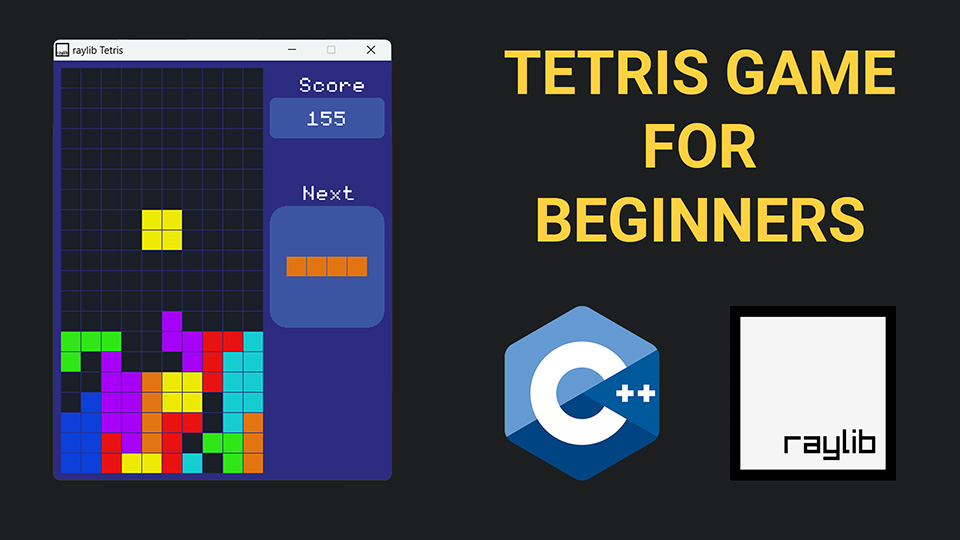

# C++ Tetris Game using raylib

🕹️🐍🎮 This GitHub repository is home to the full source code for a Tetris game built with the C++ programming language and the raylib library. 💻🎨🎧 The game uses various raylib functions for graphics, input handling, and audio and can be played on Windows, macOS, and Linux computers. 🔍📖 The code is well-structured and easy to read, making it a valuable resource for aspiring game developers looking to learn about raylib game programming.

# Video Tutorial

  

 
 

| 🌠<a href="https://abhishekpandit.onrender.com">My Website</a> |  

